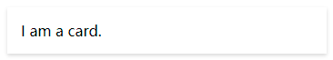

<h1>iCityMUI</h1>
<h3>
  A  Vue.js 2.0 and 3.0 UI Toolkit for Web.
</h3>

  

## Install
    npm install icitymui -S

## Quick Start
    import Vue from 'vue'
    import { Button } from 'icitymui'

    Vue.component(Button.name, Button)

## Browser Support
Modern browsers and Internet Explorer 10+.

## Usage
  + [Spin](#Spin)
  + [Button](#Button)
  + [Card](#Card)
  + [Badge](#Badge)
  + [Tabs](#Tabs)
  + [Prompt](#Prompt)
  + [Title](#Title)
  + [Skeleton](#Skeleton)
  + [Search](#Search)
  + [Alert](#Alert)
  + [Dialog](#Dialog)
  + [Toast](#Toast)
  + [ImagePicker](#ImagePicker)
  + [Picker](#Picker)
  + [Input](#Input)
  + [Password](#Password)
  + [Switch](#Switch)
  + [ListView](#ListView)

### <a id="Spin">Spin</a>
    import { Spin } from 'icitymui'   
    Vue.component(Spin.name, Spin)   

    <i-spin />

  

#### <a id="Button">Button</a>
    import { Button } from 'icitymui'   
    Vue.component(Button.name, Button)   

    <i-button>按钮</i-button>
    <i-button className="btn" type="primary" size="small" @click="go">按钮</i-button>

  * className: 自定义样式类（不支持scoped）
  * type: normal|primary|dashed
  * size: small|large
  * disabled: true|false
  * @click: () => {}

  
    
### <a id="Card">Card</a>
    import { Card } from 'icitymui'   
    Vue.component(Card.name, Card)   

    <i-card>I am a card.</i-card>

  * className: 自定义样式类（不支持scoped）

  

### <a id="Badge">Badge</a>
    import { Badge } from 'icitymui'   
    Vue.component(Badge.name, Badge)   

    <i-badge :count=99>
      

    </i-badge>

  * count: 数量

  

### <a id="Tabs">Tabs</a>
    import { Tabs } from 'icitymui'   
    Vue.component(Tabs.name, Tabs)   

    <i-tabs :data="DATA" @change="" />

  * data: [{ icon: '', name: '' }]
  * @change: (val) => {}

  

### <a id="Prompt">Prompt</a>
    import { Prompt } from 'icitymui'   
    Vue.component(Prompt.name, Prompt)   

    <i-prompt title="prompt" okText='Go' @click="">
      This is a description.
    </i-prompt>

  * icon: 图标
  * title: 标题
  * okText: 按钮文字
  * @click: () => {}

  

### <a id="Title">Title</a>
    import { Title } from 'icitymui'   
    Vue.component(Title.name, Title)   

    <i-title @click="" okText="more">Title</i-title>

  * title: 标题
  * okText: 按钮文字
  * @click: () => {}

  

### <a id="Skeleton">Skeleton</a>
    import { Skeleton } from 'icitymui'   
    Vue.component(Skeleton.name, Skeleton)   

    <i-skeleton />

  

### <a id="Search">Search</a>
    import { Search } from 'icitymui'   
    Vue.component(Search.name, Search)   

    <i-search placeholder="请输入搜索内容" align="center" />

  * type: normal|image|foucs 展示类型
  * align: left|center 对齐方式
  * value: 双向数据绑定字段
  * placeholder: 默认提示
  * @search: (val)=>{}
  * @cancel: ()=>{}

  

### <a id="Alert">Alert</a>
    import { Alert } from 'icitymui'   
    Vue.use(Alert)   

    this.$iui.alert.show({
      title: 'I am a alert.'
    })

  * title: 标题
  * content: 内容
  * @confirm: ()=>{}
  * @cancel: ()=>{}

  

### <a id="Dialog">Dialog</a>
    import { Dialog } from 'icitymui'   
    Vue.use(Dialog)   

    this.$iui.dialog.show({
      title: 'I am a dialog.'
    })

  * title: 标题
  * content: 内容
  * @confirm: ()=>{}
  * @cancel: ()=>{}

  

### <a id="Toast">Toast</a>
    import { Toast } from 'icitymui'   
    Vue.use(Toast)   

    this.$iui.toast.show(text, millisecond)

  * text: 内容
  * millisecond: 显示时间，毫秒

  

### <a id="ImagePicker">ImagePicker</a>
    import { ImagePicker } from 'icitymui'   
    Vue.use(ImagePicker)   

    this.$iui.imagePicker.show({
      title: '请选择',
      confirm: (type)=>{},
      cancel: ()=>{}
    })

  * type: camera|gallery

  

### <a id="Picker">Picker</a>
    import { Picker } from 'icitymui'   
    Vue.use(Picker)   

    this.$iui.picker.show({
      title: '请选择',
      data: [{name: '科技'}],
      confirm: (val)=>{},
      cancel: ()=>{}
    })

  

### <a id="Input">Input</a>
    import { Input } from 'icitymui'   
    Vue.component(Input.name, Input)   

    <i-input label="Label" placeholder="please input..." />
  
  * label: 标题
  * value: 值
  * placeholder: 默认提示语
  * @input: (val)=>{}

  

### <a id="Password">Password</a>
    import { Password } from 'icitymui'   
    Vue.component(Password.name, Password)   

    <i-password label="Label" placeholder="please input..." />
  
  * label: 标题
  * value: 值
  * placeholder: 默认提示语
  * @input: (val)=>{}

  

### <a id="Switch">Switch</a>
    import { Switch } from 'icitymui'   
    Vue.component(Switch.name, Switch)   

    <i-switch label="Label" defaultValue="on" />
  
  * label: 标题
  * defaultValue: on|off
  * @toggle: (val)=>{}

  

### <a id="ListView">ListView</a>
    import { ListView } from 'icitymui'   
    Vue.component(ListView.name, ListView)   

    <i-listview>
      
{{i}}

    </i-listview>
  
  * slot='header' 列表头部
  * slot='footer' 列表底部
  * @load: (done)=>{} 调用done()关闭加载动作

